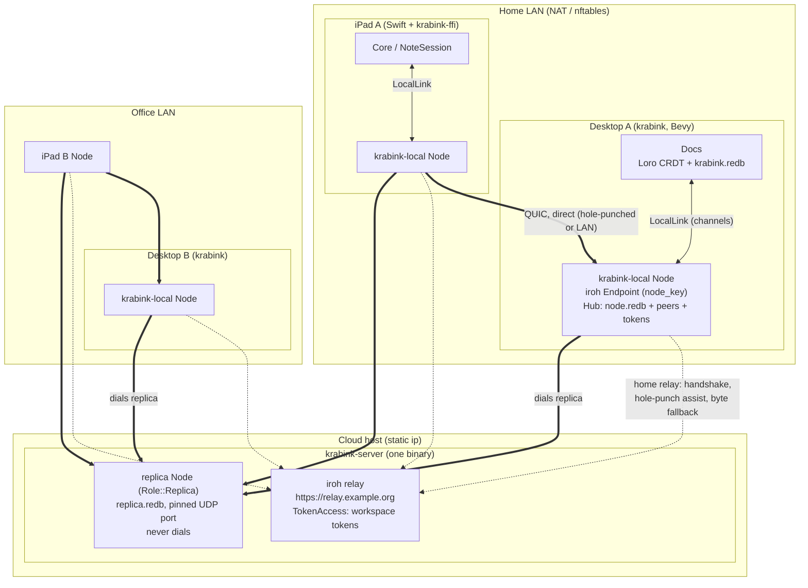
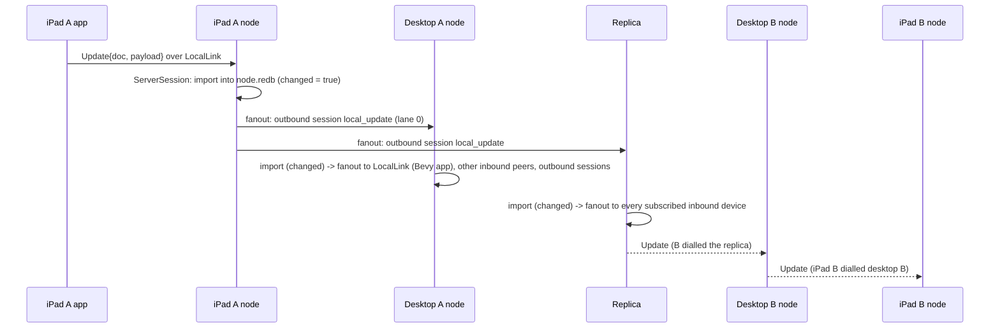
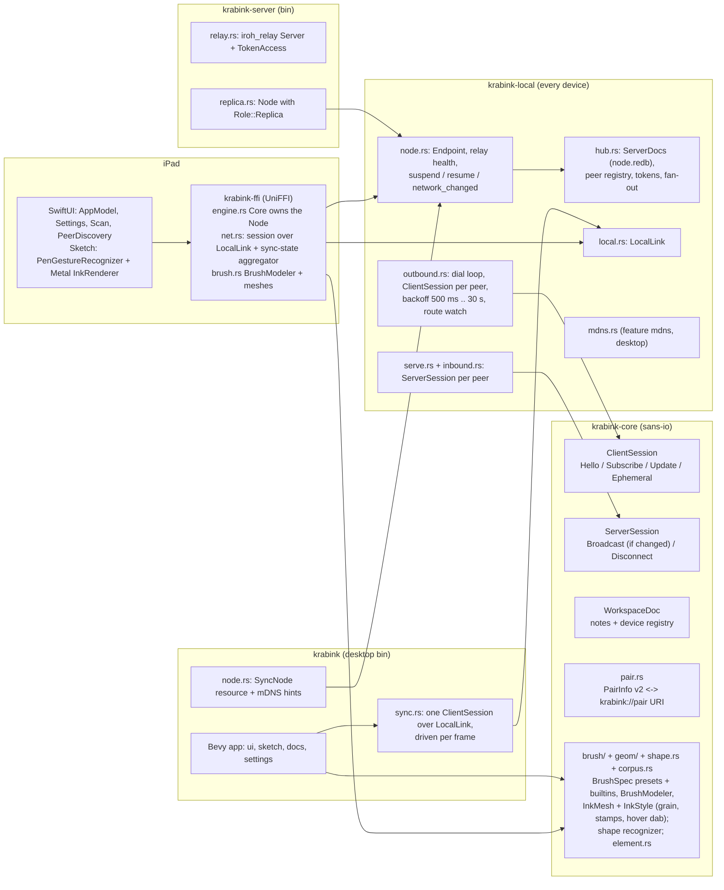

# Krabink sync architecture

How desktops, iPads and the cloud relay fit together. Source of truth:
`crates/krabink-local/src/{node,hub,outbound,inbound,serve,framing,mdns}.rs`,
`crates/krabink-server/src/{relay,replica}.rs`, `crates/krabink/src/{node,sync}.rs`,
`crates/krabink-ffi/src/{engine,net}.rs`, `crates/krabink-core/src/{sync,pair}.rs`.
For the whole stack and where each piece lives, see `docs/implementation.md`.

## 1. Topology: every device is a node, one relay in the cloud



Rules the diagram encodes:

- **Every device runs one `krabink_local::Node`.** It owns an iroh
  `Endpoint` (persisted `SecretKey` in `<data_dir>/node_key`; the
  `EndpointId` is the public key), a local mirror of every doc
  (`ServerDocs` over `node.redb`, separate from the app's own store) and a
  hub that fans updates out between peers. Nobody needs inbound
  reachability: iroh dials by public key, exchanges candidate addresses
  through the relay, hole-punches, and falls back to relaying bytes only
  when no direct path works. "Direct" is always preferred; the route in use
  is reported per peer (`PeerState::Connected { route }`).
- **The app talks to its own node like any other peer.** Bevy's
  `SyncTransport` and the FFI `Core` drive the unchanged sans-io
  `ClientSession` over an in-process `LocalLink` (two unbounded channels).
  The node serves that link with the same `ServerSession` loop it uses for
  QUIC peers, so app code never sees a socket and never bridges anything.
- **`krabink-server` is the relay plus a headless replica.** The relay is
  `iroh_relay::server::Server` gated by `TokenAccess` (the workspace
  tokens). The replica is an ordinary node with `Role::Replica`: it accepts
  every device with a valid token, mirrors every doc, never dials, has no
  local link and no mDNS, and pins its UDP port so its direct address
  survives restarts. It is what makes two LANs converge while one side is
  offline. Both live in one process; `--dev` runs plain HTTP on
  `127.0.0.1:3340` and prints a ready `krabink://pair?…` URI.
- **Who dials whom.** The device that scans a QR dials the QR's owner;
  everyone dials the replica when the pairing names one; the replica dials
  nobody. A node skips dialling a peer it already holds an inbound
  connection from (`Hub::has_inbound_from`), and the changed-gated fan-out
  (§3) makes a transient duplicate harmless.
- **One token, every door.** The workspace token gates the relay
  (`AccessControl::on_connect`) and the `Hello` on every connection. Node
  keys are transport encryption and identity only; possessing the token is
  what admits a device. A desktop always accepts its own per-install
  `workspace_token` and, once it joins a workspace, that workspace's token
  too (`RuntimeConfig::pair_token` decides which one its QR carries).
- **Relay-less LAN still works.** Without a reachable relay iroh cannot
  learn a peer's addresses, so both platforms fall back to mDNS
  (`_krabink._udp`, TXT `id=<EndpointId>`): the desktop advertises and
  browses with `mdns-sd` (`krabink_local::mdns`), the iPad browses with
  `NWBrowser` and resolves with a UDP `NWConnection` (`PeerDiscovery.swift`).
  A hit becomes `Node::add_addr_hint`, used on the next dial. With a relay
  up, iroh finds the LAN path by itself and mDNS is redundant.

## 2. Wire

- ALPN `krabink/sync/1`, one QUIC connection per peer pair.
- The dialer opens two bidirectional streams ("lanes") and writes a
  one-byte tag on each: lane 0 docs (`Hello`, `Subscribe`, `Update`,
  catch-up), lane 1 ephemeral wet ink. After the tag both directions carry
  `u32` big-endian length-prefixed frames, each frame being exactly the
  `[PROTO_VERSION][postcard]` bytes `krabink-core`'s `ClientMsg` /
  `ServerMsg` encode. `MAX_FRAME` is 64 MiB; oversize disconnects.
- Wet ink gets its own stream so a `Begin -> Points -> End` sequence stays
  ordered and reliable (QUIC datagrams are neither and are MTU-bound) but
  never queues behind a large catch-up on the docs lane.
- Both lanes feed one `ServerSession` per connection, so token gating and
  subscriptions apply to ephemeral traffic too.

## 3. Pairing flow

```mermaid
sequenceDiagram
    participant D as Desktop (settings window)
    participant P as iPad (ScanScreen)
    participant R as Relay + replica
    D->>D: PairInfo { node: <EndpointId>, token, relay?, addrs: direct_addrs(endpoint), replica? }
    D->>D: render QR of krabink://pair?node=…&token=…[&relay=…][&addr=…]*[&replica=…]
    P->>D: scan QR (camera)
    P->>P: parse_pair_uri, persist pairURI (UserDefaults)
    P->>P: Core::set_pairing: add_token, set_relay (rebind if changed), set_peers([desktop, replica?])
    P->>R: relay handshake with token; learn desktop's addresses
    P->>D: QUIC connect (direct if hole punch works, else via relay), lane 0 Hello{device, token}
    D-->>P: HelloAck, DocList
    P->>R: same for the replica
    Note over D,P: both device rows now appear in the WorkspaceDoc device registry
```

A second desktop joins with `krabink pair <uri>`, which writes `relay`,
`token`, `replica` and a `[[peers]]` entry to `config.toml`; the next launch
dials them. The in-app "join" paste box does the same live
(`settings.rs::apply_adopted`). The QR of a joined device keeps pointing at
that device but carries the workspace's token, relay and replica, so one
QR opens every path.

### Device registry: names, removal, leaving

The `WorkspaceDoc` carries one `DeviceMeta` row per device (`id`, `name`,
`platform`, `last_seen_ms`). Each device only ever writes its own row:

- **Register** on every (re)connect: desktop in `sync.rs` on
  `ClientEffect::Connected`, iPad in `AppModel.registerDevice()` (pair time
  and every `SyncState.connected`).
- **Rename** is the same upsert with a new name. The desktop keeps the name
  in `config.toml` (`device_name`, hostname when unset; `sync.rs::
  set_local_device_name`, mDNS re-advertised); the iPad in `UserDefaults`
  (`deviceName`; iOS hides the real device name from apps, so the default
  is generic). Peers see the change through the normal workspace update:
  the FFI raises `CoreListener::devices_changed`, the desktop window reads
  `workspace.devices()` every frame.
- **Remove** (another device's row) is `remove_device` on either platform:
  a mutual, per-peer unpair. It drops the row and calls `Node::unpair(device)`,
  which sends the peer a `ClientMsg`/`ServerMsg::Unpair` over the live
  connection, then stops dialling it. The removed peer, hearing the unpair
  for the node its pairing points at, forgets that pairing (FFI
  `net::watch_unpaired`, desktop `node::poll_unpaired`), so it does not
  reconnect and re-add its row. `HelloAck` carries the responder's device
  id so the dialer can match a registry row to its outbound connection.
- **Leave / unpair** (`Core::unpair`, desktop "Leave workspace"): remove
  our own row, stop accepting the workspace token, forget the pairing
  (`pairURI` / `config.toml`), then after `UNPAIR_LINGER` (750 ms, so the
  removal has been handed to the peers) drop every peer and the relay. The
  QR falls back to the device's own token; notes already synced stay local.

## 4. One update, end to end (iPad A stroke reaches iPad B)



- **Changed-gated fan-out is the loop breaker.** `DocProvider::import_update`
  and `ClientDocs::import` return whether the CRDT actually changed
  (`Result<bool>`); `ServerSession` emits `Broadcast` and `Hub::fanout_update`
  forwards only on `true`. A mesh with cycles (A dials the replica, B dials
  both A and the replica) therefore converges without echo storms: the
  second copy of an update is a no-op import and stops there.
- Inbound peers subscribed to the doc get a raw `ServerMsg::Update`;
  outbound sessions forward it as their own `local_update`. The
  originating peer is skipped.
- Every outbound session subscribes to every doc the hub knows
  (`Hub::known_docs`) plus any doc the app subscribes to later
  (`Hub::want_doc`), with the hub's own version vector, so catch-up is
  correct per peer.
- **Wet ink crosses hops too.** `Hub::fanout_ephemeral` mirrors
  `fanout_update` on lane 1 without touching the store, so a stroke in
  progress on iPad A is visible on iPad B through desktop A, the replica
  and desktop B.

## 5. Per-process layering



Ink is one pipeline on both platforms, in three stages inside the core.
Stage 1 (`brush/input.rs`): raw pen samples are smoothed by `BrushModeler`
into the `StrokePoint`s the stroke stores (position, force, time, tilt);
estimated force/tilt is patched in by `update`. Stage 2
(`brush/dynamics.rs`): a `BrushSpec` — the tool's preset — turns each
point into a tip state (size, opacity, nib orientation) from pressure,
speed, tilt and distance to the ends. Stage 3 (`geom/`): the tip states
become an `InkMesh` — round lyon ribbons, oriented nib hulls, or one quad
per dab for stamped brushes — whose vertices carry position, stroke-space
(or tip-space) uv and opacity, plus an `InkStyle` (colour, opacity, blend,
overlap, hardness, mask) per stroke. A stroke's brush is the tool's preset
or a custom spec snapshotted on the stroke; the workspace doc carries a
shared brush library, and the app bundles a stamped crayon and a grainy
pencil. Renderers upload the mesh verbatim and apply the style in one
über-shader (Metal on the iPad, WGSL on the desktop): linear-light
premultiplied blending in an sRGB framebuffer, Multiply for the
highlighter, and a depth-slot trick that makes `Overlap::Discard` ink
write once per pixel so a marker never darkens where it crosses itself.
Thumbnails render through the same Metal pipeline offscreen. The live
stroke, the committed stroke and every remote copy are the same geometry;
wet ink carries the stage-1 points so receivers run the same fold. See
`docs/plans/ink-renderer.md` and `docs/plans/brush-engine.md`.

A note's ink is one z-ordered list of `Element`s (the `page` list, each
element anchored to the source line it was drawn on by a Loro stable
cursor): freehand `Stroke`s and `ShapeElement`s (line, arrow, rectangle,
ellipse, with reserved Excalidraw-style end bindings). Ink and text share
one surface: the styled markdown source on the iPad and the desktop, with
a reading-view toggle that hides the markers and keeps the ink on its
lines. Holding the Pencil still mid-stroke runs
`shape::recognize` on the modelled points (hold trimming, arc-length
resampling, ShortStraw corners, closure, PCA/corner fits, all thresholds
relative to the stroke's size); a hit previews the snapped outline and
pen-up commits the shape under the wet stroke's id, so every receiver swaps
the provisional ink for the shape the way it does for a stroke. Shapes
render through `Shape::outline` and the same `stroke_mesh`. See
`docs/plans/shape-recognizer.md`.

## 6. Lifecycle on the iPad

`Core::new` starts the node on the FFI's single-thread tokio runtime.
`suspend()` (app backgrounded) closes every connection and the endpoint
but keeps the local link, key and store; `connect()` rebinds a fresh
endpoint with the same key and redials every peer; `network_changed()`
(from `NWPathMonitor`) pokes the endpoint to re-probe paths. The
`SyncState` the UI shows is an aggregate over peers: the best connected
route wins (direct over relay), then any `Fatal` (bad token on a peer or
on the relay), then `Connecting`, else `Disconnected`.

## 7. Cloud deployment

```toml
[relay]
http_listen = "0.0.0.0:80"        # ACME challenge + plain-HTTP relay
quic_listen = "0.0.0.0:7842"      # UDP; QUIC address discovery (needs TLS)
public_url  = "https://relay.example.org"
tokens      = ["<workspace token>"]
[relay.tls]
mode = "letsencrypt"              # or "manual" with cert/key
https_listen = "0.0.0.0:443"
hostname = "relay.example.org"
contact = "mailto:ops@example.org"
prod = true
[replica]
enable = true
db = "/var/lib/krabink/replica.redb"
key = "/var/lib/krabink/replica.key"
udp_port = 7843
```

Open TCP 80/443 and UDP 7842/7843 inbound. Devices whose networks block
UDP still sync through the relay's HTTPS path, which is why production
needs TLS. Ctrl-C shuts the replica down (final checkpoint) before the
relay. Without TLS (`--dev`) there is no public-address discovery, so peers
behind different NATs stay on the relay path; fine on one LAN.

## 8. Failure modes and what happens

| Situation | Behaviour |
|---|---|
| Hole punch fails (symmetric NAT, UDP blocked) | iroh keeps the connection on the relay path; the peer row shows "via relay". It keeps probing and migrates to a direct path when one appears. |
| iPad leaves the LAN | The QUIC connection migrates (new address, same key) or reconnects through the relay after one backoff step. Edits queue locally in the CRDT meanwhile. |
| Relay unreachable, same LAN | Existing direct connections keep running. New dials need an address: the QR's `addr=` hints or an mDNS hit. Off-LAN with no relay: nothing connects. |
| Relay unreachable, different LANs | Islands until the relay is back; each island still syncs internally. |
| Replica down | Devices that are online at the same time still converge directly. Offline edits wait for the replica to return. |
| Desktop restarted (new UDP port) | Stored `addr=` hints are stale; through the relay the new address is learned automatically, on a relay-less LAN mDNS re-announces it. Its key and `EndpointId` are unchanged. |
| Wrong token | The relay refuses the client (`RelayHealth.error`) and any node rejects the `Hello`; the peer goes `Fatal` and stays there until `set_peers` / `resume`. Shown as "error: …" in Settings. |
| Local Network permission denied on iOS | No mDNS; the relay route is the only way to find the desktop. |
| Duplicate connection (both sides dialled) | Node skips the dial while an inbound connection from that peer is up; if both raced, the extra copy of each update is a no-op import. |
| Bad import on the app's local link | `ClientEffect::Fatal`; the app reopens the link after 5 s and the fresh handshake re-subscribes and backfills. |
