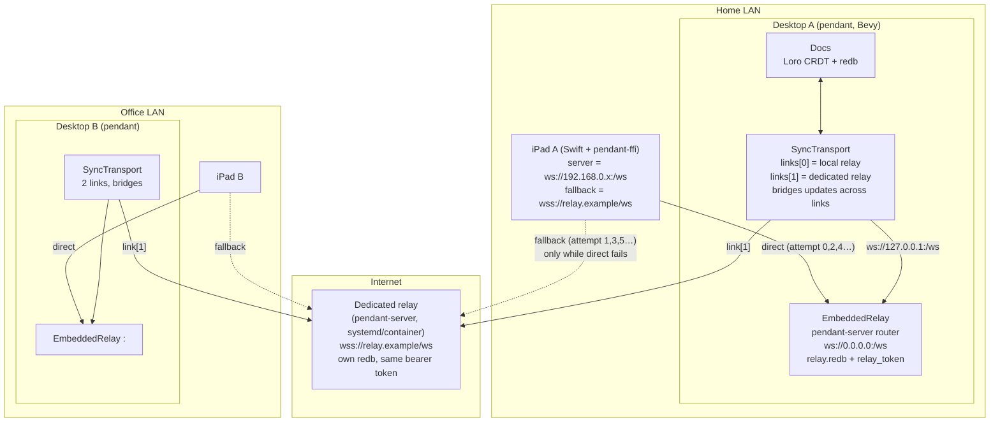
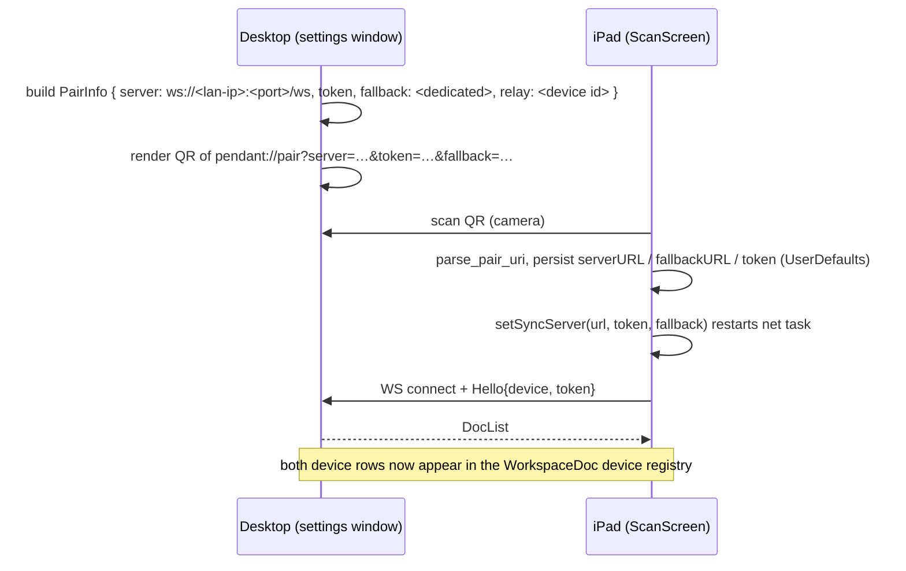
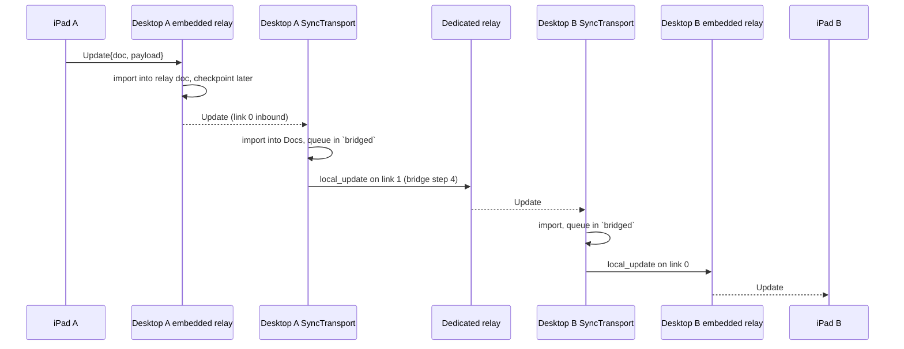
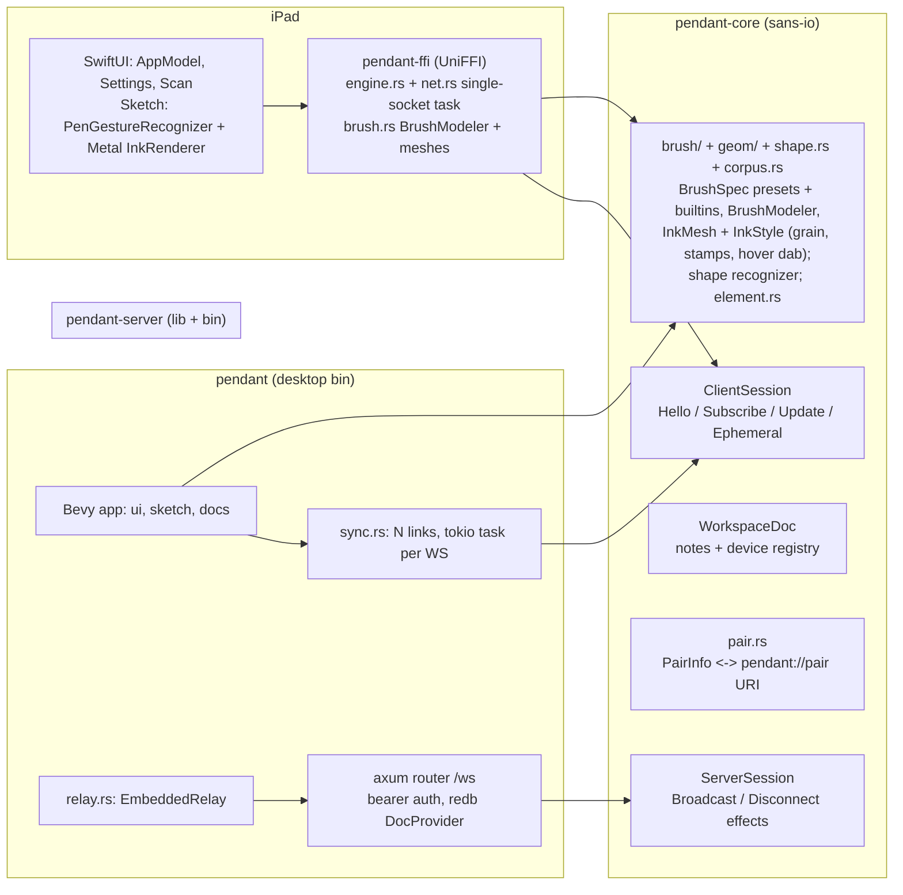

# Pendant sync architecture

How a desktop, an iPad, and the relays fit together. Source of truth:
`crates/pendant/src/{relay,sync}.rs`, `crates/pendant-server/src/relay.rs`,
`crates/pendant-ffi/src/net.rs`, `crates/pendant-core/src/{sync,pair}.rs`.
For the whole stack and where each piece lives, see `docs/implementation.md`.

## 1. Topology: two desktops, two iPads, one dedicated relay

Rules the diagram encodes:

- **Every desktop is a relay.** `EmbeddedRelay::start` binds `0.0.0.0` on
  an ephemeral port (a fresh one each launch; `--relay-listen` pins one),
  serves the same axum router as the standalone `pendant-server`, and keeps
  its own `relay.redb` plus a per-install `relay_token`. The desktop
  connects to itself over loopback as link 0. Port 8722 belongs to the
  dedicated `pendant-server` only: sharing it would let macOS route the
  desktop's loopback self-link to the dedicated server (wildcard and
  loopback binds coexist under `SO_REUSEADDR`, most specific wins) and
  fail auth. Paired devices cope with the changing port by re-finding the
  desktop over mDNS via `relay_id`: the iPad in `RelayDiscovery.swift`, a
  joined desktop in `discovery.rs` (browses `_pendant._tcp`, matches TXT
  `id`, swaps the direct link and rewrites `config.toml` on a hit).
- **Dedicated relay is optional and shared.** `server`/`token` in
  `config.toml` (or `--server`) become link 1. It is the only thing two LANs
  have in common, so it is what makes Desktop A and Desktop B converge.
- **iPad never bridges.** It holds one socket at a time and alternates
  direct / fallback per reconnect attempt (`net.rs`), so a lost LAN path
  lands on the dedicated relay after one backoff and keeps probing LAN.
- **One token, both doors.** The embedded relay accepts its own
  `relay_token` and the config `token`; the pair URI carries whichever the
  desktop chose (`RuntimeConfig::pair_token`).

## 2. Pairing flow

`fallback=` is ignored by older parsers, so pre-fallback iPads still pair to
the direct path only.

## 3. One update, end to end (iPad A stroke reaches iPad B)

- Bridge rule (`drive_sync` step 4): any `ServerMsg::Update` or catch-up
  received on link *i* is re-sent with `session.local_update` on every other
  link. Loro imports are idempotent, so the originating relay drops the echo.
- Local edits on a desktop go out on **all** links at once (step 1), no
  bridging needed.
- Subscriptions are per link: opening a note subscribes on every ready link
  with that link's own version vector, so catch-up is correct per relay.

## 4. Per-process layering

Ink is one pipeline on both platforms, in three stages inside the core.
Stage 1 (`brush/input.rs`): raw pen samples are smoothed by `BrushModeler`
into the `StrokePoint`s the stroke stores (position, force, time, tilt);
estimated force/tilt is patched in by `update`. Stage 2
(`brush/dynamics.rs`): a `BrushSpec` — the tool's preset — turns each
point into a tip state (size, opacity, nib orientation) from pressure,
speed, tilt and distance to the ends. Stage 3 (`geom/`): the tip states
become an `InkMesh` — round lyon ribbons, oriented nib hulls, or one quad
per dab for stamped brushes — whose vertices carry position, stroke-space
(or tip-space) uv and opacity, plus an `InkStyle` (colour, opacity, blend,
overlap, hardness, mask) per stroke. A stroke's brush is the tool's preset
or a custom spec snapshotted on the stroke; the workspace doc carries a
shared brush library, and the app bundles a stamped crayon and a grainy
pencil. Renderers upload the mesh verbatim and apply the style in one
über-shader (Metal on the iPad, WGSL on the desktop): linear-light
premultiplied blending in an sRGB framebuffer, Multiply for the
highlighter, and a depth-slot trick that makes `Overlap::Discard` ink
write once per pixel so a marker never darkens where it crosses itself.
Thumbnails render through the same Metal pipeline offscreen. The live
stroke, the committed stroke and every remote copy are the same geometry;
wet ink carries the stage-1 points so receivers run the same fold. See
`docs/plans/ink-renderer.md` and `docs/plans/brush-engine.md`.

A sketch is one z-ordered list of `Element`s: freehand `Stroke`s and
`ShapeElement`s (line, arrow, rectangle, ellipse, with reserved
Excalidraw-style end bindings). Holding the Pencil still mid-stroke runs
`shape::recognize` on the modelled points (hold trimming, arc-length
resampling, ShortStraw corners, closure, PCA/corner fits, all thresholds
relative to the stroke's size); a hit previews the snapped outline and
pen-up commits the shape under the wet stroke's id, so every receiver swaps
the provisional ink for the shape the way it does for a stroke. Shapes
render through `Shape::outline` and the same `stroke_mesh`. See
`docs/plans/shape-recognizer.md`.

## 5. Failure modes and what happens

| Situation | Behaviour |
|---|---|
| iPad leaves LAN, dedicated relay configured | Next reconnect attempt is odd, so it targets the fallback. Back on LAN, the following even attempt probes direct again. |
| iPad leaves LAN, no dedicated relay | Backoff loop against direct only, 500 ms to 30 s. Edits queue locally in the CRDT. |
| Desktop offline | Its embedded relay is gone. iPads on that LAN converge only via the dedicated relay; on desktop restart, link 0 and link 1 both catch up and the desktop re-bridges. |
| Dedicated relay down | Each LAN keeps working through its desktop's relay. Cross-LAN convergence resumes when link 1 reconnects. |
| Desktop restarted (new relay port) | Stored direct URLs are stale; iPads and joined desktops browse `_pendant._tcp` for the desktop's `relay_id` and switch to the new port. Off-LAN (no multicast) a joined desktop keeps the stored URL and the dedicated relay carries on. |
| Pinned `--relay-listen` port busy | Embedded relay falls back to an ephemeral port; QR advertises the real one. |
| Two desktops, no dedicated relay | Two islands. Nothing bridges them. |

## Not covered by bridging

- **Wet ink (`Ephemeral`)** is forwarded only within the relay it arrived
  on. A stroke in progress is visible to peers on the same relay, not across
  the bridge. Committed strokes (CRDT updates) do cross.
- **Device removal** is a `WorkspaceDoc` CRDT edit, so it propagates like
  any other update.
